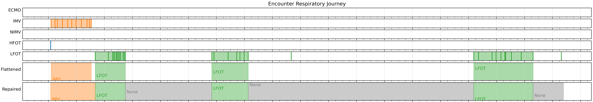

# Oxygen Delivery Modalities

Oxygenation delivery devices and settings are notoriously difficult to extract from the elecronic health record owing to the fact that they are heterogenously captured and stored. To faciltiate identification of oxygen delivery modalities, a heuristic was developed ([link to published article](https://academic.oup.com/jamia/article/29/5/813/6517187)) and expanded upon to make it easy to extract and stitch together oxygen delivery modalities on a patient level. 

This heuristic works by extracting relevant oxygenation modalities from multiple flowsheet rows, flattens them into one timeline and then repairs the timeline according to user specified preferences (Figure 1).

Figure 1. Sample respiratory trajectory showing the effective function of the heuristic. 

The function can be called with 2 paramters that affect how the timeline is repaired:

1. _MIN_DUR_HRS_: The minimum number of hours an oxygen delivery method should be provided to be included in the algorithm. This is important because sometimes patients have oxygen delivery methods that flip back and forth likely owing to a charting error. This helps smooth out the noise and identify likely actual oxygen delivery modalities. The recommended minimum value is 2 hours, but the default, which the publication was based on, is 6 hours. 

2. _EXTEND_HRS_: Charting of an oxygen delivery modality can occur at irregular frequencies. This paramter lets you adjust the duration of time between measurements which should be considered a continuation of the prior oxygen delivery modality. For example, on the medical floor vitals may be charted every 8 hours, so setting the EXTEND_HRS paramter to at least 8 hours will let you assume the same oxygen delivery modality occured between these two charting events. The default is 24 hours. 

**Special note about Tracheostomies**: Tracheostomies are unique in that multiple oxygen modalities can be used through a tracheostomy making it challenging to understand what oxygen delivery system a patient is recieving. Therefore, the function returns a column "via_trach" that yields a result of true if the oxygen delivery modality was used in the presence of a tracheostomy. If desired, a separate function will return raw tracheostomy data so it's presence can be identified (set RETURN_TRACH=True, default is False). 	

**Note:** The assignment of oxygen modality is made from "best guesses" using the ventilator, ecmo, NPPV flowsheet names and "O2 Del Method" values. Often times the values may be conflicting or not clear so a mapping file was created to deterministically assign an oxygen delivery modality. These can be updated by modifying the flowsheet "o2delmethod_map_reviewed_am.csv". Also, this is a heuristic, so likely it is not perfect, but represents one approach which has been published upon. 

***

## Use of the heuristic
To use this algorithm you need two dataframes:

1. Encounters with start and end times: If you use the repair encounter heuristic you will have to call df.explode("inpatient_data_id) and set the astype to 'float' (see example below).
2. Flowsheet data

The two dataframes should have the followig structure:

### Encounters:
|PAT_MRN_ID|CSN|INPATIENT_DATA_ID|ADMIT_TIME|DISCHARGE_TIME|
|:---------|---|-----------------|----------|--------------|
|123456789 |111111|9999999|1955-11-05 21:04|1985-10-26 21:04|

### Flowsheets:
|PAT_MRN_ID|CSN|INPATIENT_DATA_ID|PERFORMED|FLOWSHEET_NAME|MEASURE_NAME|VALUE|
|:---------|---|-----------------|----------|--------------|-----------|-----|
|123456789 |111111|9999999|1955-11-05 21:04| Ventilator Documentation |Vent Status|In Use|

### To call the function and set the paramters:

		#Repair Encounters
		repaired_enc = repair_encounters(encouterDF)
		repaired_enc = repaired_enc.explode('INPATIENT_DATA_ID')
		repaired_enc.INPATIENT_DATA_ID=r repaired_enc.INPATIENT_DATA_ID.astype(float)
		
		#Repair O2 Using Repaired Encounters
		repairedo2 = repairo2delmethods(flowsheet_data_frame, repaired_enc, MIN_DUR_HRS = 2, EXTEND_HRS = 24, RETURN_TRACH=False)
		
		
