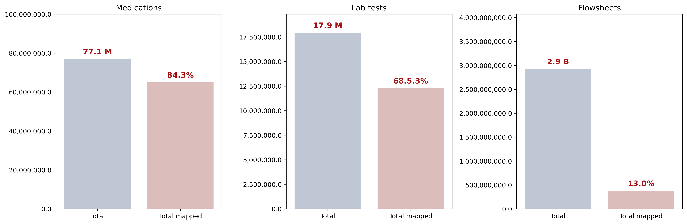

# Pulmonology Critical Care Data Types

The Data Core is updated on a daily basis and includes the following types of information:

 * Flowsheet data (including vital signs & oxygenation data)
 * Laboratory results
 * Comorbidity ICD codes
 * Procedural ICD codes
 * Culture and susceptability data
 * Imaging results
 * Admission, Discharge, and Transfer information
 * Medication information

The Data Core is a rich resource with significant amounts of information that have been hand curated to to ensure high quality, clinically appropriate information. 

As of 12/2023, the data core had 2.9 billion flowsheet entries and 77.1 million medication orders and 19.8 million laboratory tests performed (Figure 1). The most frequent and highest yield flowsheet, medication and lab tests have been mapped (Figure 1), and will continue to be updated on a regular and case-by-case basis. The items mapped to exhaustion (all items ordered at least 1 time in 4 years) can be found [here](exhaustivelymappeditems.csv). **Please note: This list contains mapping for more than the listed items, but if they are not listed here, they were not mapped to exhaustion, only mapped to 1000 orders in 4 years).**

#####**Figure 1.** Unique flowsheet, medication and laboratory entries found in the Pulmonology & Critical Care Data Core from 7/1/2018 until 12/31/2023. Total indicates individual entries and Total Mapped is the percent of total entities covered by the current mappings. These mappings will continue to be updated on a regular and case-by-case-basis.
